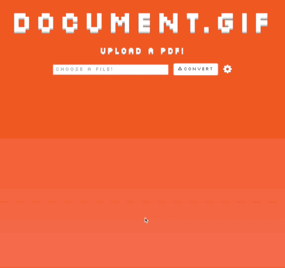

# Document.gif

## Convert pdf documents to gifs

Document.gif was created to...convert PDF documents to animated GIF. Simple. Probably unnecessary. But quite a fun project. 

## Screen shot

Short animated GIF of Document.gif in action.

## Features

+ PDFs converted to animated GIFs through imagemagick and the [mini_magick](https://github.com/minimagick/minimagick) gem 
+ Asynchronous image processing using Celluloid and the [sucker_punch](https://github.com/brandonhilkert/sucker_punch) gem
+ Sinatra Server-Sent Events to alert the client when the PDF conversion has finished

## Usage

Visit [Doc2Gif](http://www.doc2gif.xyz/) and convert your favorite PDF into an impossible-to-read animated GIF!

## Development/Contribution

Please feel free to contribute to the project. 

## Created by

- [Walter Beller-Morales](https://github.com/walterbm)

## License

Document.gif is MIT Licensed. See LICENSE for details.